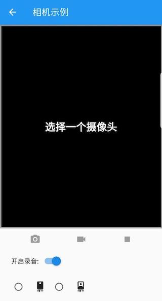
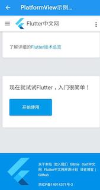

# 12.6 Texture and PlatformView

This section mainly introduces how to share images between native and Flutter, and how to nest native components in Flutter.

## 12.6.1 Texture (Example: Using the camera)

As mentioned earlier, Flutter itself is only a UI system, and we can interact with the native through the messaging mechanism for invoking some system capabilities. However, this messaging mechanism cannot cover all application scenarios. For example, we want to call the camera to take photos or record videos, but during the process of taking photos and recording videos, we need to display the preview screen in our Flutter UI. If we want To use the message channel mechanism defined by Flutter to achieve this function, it is necessary to transfer each frame of pictures collected by the camera from the native to Flutter. This will be very costly because the image or video data is transmitted in real time through the message channel It will inevitably cause huge consumption of memory and CPU! To this end, Flutter provides a texture-based image data sharing mechanism.

Texture can be understood as an object that stores the image data to be drawn in the GPU. The Flutter engine directly maps the texture data in memory (without data transfer between native and Flutter), and Flutter will give each Texture Assign an id, and a `Texture`component is provided in Flutter . The `Texture`constructor is defined as follows:

``` dart 
const Texture({
 Key key,
 @required this.textureId,
})

```

`Texture`Components are `textureId`associated with texture data; when the `Texture`component is drawn, Flutter will automatically find the texture data of the corresponding id from the memory, and then draw it. You can summarize the entire process: the image data is first cached in the native part, and then connected to the `textureId`cache in the Flutter part , and finally drawn by Flutter.

If we, as a plug-in developer, we distribute `textureId`it in the native code, `Texture`how do we obtain `textureId`it when using components on the Flutter side ? This is back to the previous content, `textureId`which can be passed through MethodChannel.

In addition, it is worth noting that when the image captured by the native camera changes, the `Texture`component will automatically redraw, which does not require us to write any Dart code to control.

### Texture usage

If we want to manually implement a camera plug-in, the same steps as the "obtain remaining battery" plug-in described in the previous sections, we need to implement the native part and the Flutter part separately. Considering that most readers may not understand both Android development and iOS development at the same time, it may be meaningless if we spend a lot of space to introduce the implementation of different ends. In addition, due to the official camera plug-in and video playback provided by Flutter ( Video_player) plug-ins are implemented using Texture. They are very good examples of Texture. Therefore, the specific process of using Texture will not be introduced in this book. Readers are interested in viewing the implementation code of camera and video_player. Below we focus on how to use camera and video_player.

### Camera example

Let's take a look at an example that comes with the camera package, which contains the following functions:

1.  You can take a photo or a video, and you can save it after the shooting is complete; the numbered video can be played and previewed.
2.  Can switch camera (front camera, rear camera, other)
3.  You can display a preview of what has been shot.

Let's take a look at the specific code:

1.  First, rely on the latest version of the camera plug-in and download the dependencies.
   
``` dart 
   dependencies:
     ...  //省略无关代码
     camera: ^0.5.2+2
   
```
   
2.  `main`Get the list of available cameras in the method.
   
``` dart 
   void main() async {
     // 获取可用摄像头列表，cameras为全局变量
     cameras = await availableCameras();
     runApp(MyApp());
   }
   
```
   
3.  Build the UI. Now we build the test interface as shown in Figure 12-4:
   
    The line is the complete code:
   
``` dart 
   import 'package:camera/camera.dart';
   import 'package:flutter/material.dart';
   import '../common.dart';
   import 'dart:async';
   import 'dart:io';
   import 'package:path_provider/path_provider.dart';
   import 'package:video_player/video_player.dart'; //用于播放录制的视频
   
   /// 获取不同摄像头的图标（前置、后置、其它）
   IconData getCameraLensIcon(CameraLensDirection direction) {
     switch (direction) {
       case CameraLensDirection.back:
         return Icons.camera_rear;
       case CameraLensDirection.front:
         return Icons.camera_front;
       case CameraLensDirection.external:
         return Icons.camera;
     }
     throw ArgumentError('Unknown lens direction');
   }
   
   void logError(String code, String message) =>
       print('Error: $code\nError Message: $message');
   
   // 示例页面路由
   class CameraExampleHome extends StatefulWidget {
     @override
     _CameraExampleHomeState createState() {
       return _CameraExampleHomeState();
     }
   }
   
   class _CameraExampleHomeState extends State<CameraExampleHome>
       with WidgetsBindingObserver {
     CameraController controller;
     String imagePath; // 图片保存路径
     String videoPath; //视频保存路径
     VideoPlayerController videoController;
     VoidCallback videoPlayerListener;
     bool enableAudio = true;
   
     @override
     void initState() {
       super.initState();
       // 监听APP状态改变，是否在前台
       WidgetsBinding.instance.addObserver(this);
     }
   
     @override
     void dispose() {
       WidgetsBinding.instance.removeObserver(this);
       super.dispose();
     }
   
     @override
     void didChangeAppLifecycleState(AppLifecycleState state) {
       // 如果APP不在在前台
       if (state == AppLifecycleState.inactive) {
         controller?.dispose();
       } else if (state == AppLifecycleState.resumed) {
         // 在前台
         if (controller != null) {
           onNewCameraSelected(controller.description);
         }
       }
     }
   
     final GlobalKey<ScaffoldState> _scaffoldKey = GlobalKey<ScaffoldState>();
   
     @override
     Widget build(BuildContext context) {
       return Scaffold(
         key: _scaffoldKey,
         appBar: AppBar(
           title: const Text('相机示例'),
         ),
         body: Column(
           children: <Widget>[
             Expanded(
               child: Container(
                 child: Padding(
                   padding: const EdgeInsets.all(1.0),
                   child: Center(
                     child: _cameraPreviewWidget(),
                   ),
                 ),
                 decoration: BoxDecoration(
                   color: Colors.black,
                   border: Border.all(
                     color: controller != null && controller.value.isRecordingVideo
                         ? Colors.redAccent
                         : Colors.grey,
                     width: 3.0,
                   ),
                 ),
               ),
             ),
             _captureControlRowWidget(),
             _toggleAudioWidget(),
             Padding(
               padding: const EdgeInsets.all(5.0),
               child: Row(
                 mainAxisAlignment: MainAxisAlignment.start,
                 children: <Widget>[
                   _cameraTogglesRowWidget(),
                   _thumbnailWidget(),
                 ],
               ),
             ),
           ],
         ),
       );
     }
   
     /// 展示预览窗口
     Widget _cameraPreviewWidget() {
       if (controller == null || !controller.value.isInitialized) {
         return const Text(
           '选择一个摄像头',
           style: TextStyle(
             color: Colors.white,
             fontSize: 24.0,
             fontWeight: FontWeight.w900,
           ),
         );
       } else {
         return AspectRatio(
           aspectRatio: controller.value.aspectRatio,
           child: CameraPreview(controller),
         );
       }
     }
   
     /// 开启或关闭录音
     Widget _toggleAudioWidget() {
       return Padding(
         padding: const EdgeInsets.only(left: 25),
         child: Row(
           children: <Widget>[
             const Text('开启录音:'),
             Switch(
               value: enableAudio,
               onChanged: (bool value) {
                 enableAudio = value;
                 if (controller != null) {
                   onNewCameraSelected(controller.description);
                 }
               },
             ),
           ],
         ),
       );
     }
   
     /// 显示已拍摄的图片/视频缩略图。
     Widget _thumbnailWidget() {
       return Expanded(
         child: Align(
           alignment: Alignment.centerRight,
           child: Row(
             mainAxisSize: MainAxisSize.min,
             children: <Widget>[
               videoController == null && imagePath == null
                   ? Container()
                   : SizedBox(
                 child: (videoController == null)
                     ? Image.file(File(imagePath))
                     : Container(
                   child: Center(
                     child: AspectRatio(
                         aspectRatio:
                         videoController.value.size != null
                             ? videoController.value.aspectRatio
                             : 1.0,
                         child: VideoPlayer(videoController)),
                   ),
                   decoration: BoxDecoration(
                       border: Border.all(color: Colors.pink)),
                 ),
                 width: 64.0,
                 height: 64.0,
               ),
             ],
           ),
         ),
       );
     }
   
     /// 相机工具栏
     Widget _captureControlRowWidget() {
       return Row(
         mainAxisAlignment: MainAxisAlignment.spaceEvenly,
         mainAxisSize: MainAxisSize.max,
         children: <Widget>[
           IconButton(
             icon: const Icon(Icons.camera_alt),
             color: Colors.blue,
             onPressed: controller != null &&
                 controller.value.isInitialized &&
                 !controller.value.isRecordingVideo
                 ? onTakePictureButtonPressed
                 : null,
           ),
           IconButton(
             icon: const Icon(Icons.videocam),
             color: Colors.blue,
             onPressed: controller != null &&
                 controller.value.isInitialized &&
                 !controller.value.isRecordingVideo
                 ? onVideoRecordButtonPressed
                 : null,
           ),
           IconButton(
             icon: const Icon(Icons.stop),
             color: Colors.red,
             onPressed: controller != null &&
                 controller.value.isInitialized &&
                 controller.value.isRecordingVideo
                 ? onStopButtonPressed
                 : null,
           )
         ],
       );
     }
   
     /// 展示所有摄像头
     Widget _cameraTogglesRowWidget() {
       final List<Widget> toggles = <Widget>[];
   
       if (cameras.isEmpty) {
         return const Text('没有检测到摄像头');
       } else {
         for (CameraDescription cameraDescription in cameras) {
           toggles.add(
             SizedBox(
               width: 90.0,
               child: RadioListTile<CameraDescription>(
                 title: Icon(getCameraLensIcon(cameraDescription.lensDirection)),
                 groupValue: controller?.description,
                 value: cameraDescription,
                 onChanged: controller != null && controller.value.isRecordingVideo
                     ? null
                     : onNewCameraSelected,
               ),
             ),
           );
         }
       }
   
       return Row(children: toggles);
     }
   
     String timestamp() => DateTime.now().millisecondsSinceEpoch.toString();
   
     void showInSnackBar(String message) {
       _scaffoldKey.currentState.showSnackBar(SnackBar(content: Text(message)));
     }
   
     // 摄像头选中回调
     void onNewCameraSelected(CameraDescription cameraDescription) async {
       if (controller != null) {
         await controller.dispose();
       }
       controller = CameraController(
         cameraDescription,
         ResolutionPreset.high,
         enableAudio: enableAudio,
       );
   
       controller.addListener(() {
         if (mounted) setState(() {});
         if (controller.value.hasError) {
           showInSnackBar('Camera error ${controller.value.errorDescription}');
         }
       });
   
       try {
         await controller.initialize();
       } on CameraException catch (e) {
         _showCameraException(e);
       }
   
       if (mounted) {
         setState(() {});
       }
     }
   
     // 拍照按钮点击回调
     void onTakePictureButtonPressed() {
       takePicture().then((String filePath) {
         if (mounted) {
           setState(() {
             imagePath = filePath;
             videoController?.dispose();
             videoController = null;
           });
           if (filePath != null) showInSnackBar('图片保存在 $filePath');
         }
       });
     }
   
     // 开始录制视频
     void onVideoRecordButtonPressed() {
       startVideoRecording().then((String filePath) {
         if (mounted) setState(() {});
         if (filePath != null) showInSnackBar('正在保存视频于 $filePath');
       });
     }
   
     // 终止视频录制
     void onStopButtonPressed() {
       stopVideoRecording().then((_) {
         if (mounted) setState(() {});
         showInSnackBar('视频保存在: $videoPath');
       });
     }
   
     Future<String> startVideoRecording() async {
       if (!controller.value.isInitialized) {
         showInSnackBar('请先选择一个摄像头');
         return null;
       }
   
       // 确定视频保存的路径
       final Directory extDir = await getApplicationDocumentsDirectory();
       final String dirPath = '${extDir.path}/Movies/flutter_test';
       await Directory(dirPath).create(recursive: true);
       final String filePath = '$dirPath/${timestamp()}.mp4';
   
       if (controller.value.isRecordingVideo) {
         // 如果正在录制，则直接返回
         return null;
       }
   
       try {
         videoPath = filePath;
         await controller.startVideoRecording(filePath);
       } on CameraException catch (e) {
         _showCameraException(e);
         return null;
       }
       return filePath;
     }
   
     Future<void> stopVideoRecording() async {
       if (!controller.value.isRecordingVideo) {
         return null;
       }
   
       try {
         await controller.stopVideoRecording();
       } on CameraException catch (e) {
         _showCameraException(e);
         return null;
       }
   
       await _startVideoPlayer();
     }
   
     Future<void> _startVideoPlayer() async {
       final VideoPlayerController vcontroller =
       VideoPlayerController.file(File(videoPath));
       videoPlayerListener = () {
         if (videoController != null && videoController.value.size != null) {
           // Refreshing the state to update video player with the correct ratio.
           if (mounted) setState(() {});
           videoController.removeListener(videoPlayerListener);
         }
       };
       vcontroller.addListener(videoPlayerListener);
       await vcontroller.setLooping(true);
       await vcontroller.initialize();
       await videoController?.dispose();
       if (mounted) {
         setState(() {
           imagePath = null;
           videoController = vcontroller;
         });
       }
       await vcontroller.play();
     }
   
     Future<String> takePicture() async {
       if (!controller.value.isInitialized) {
         showInSnackBar('错误: 请先选择一个相机');
         return null;
       }
       final Directory extDir = await getApplicationDocumentsDirectory();
       final String dirPath = '${extDir.path}/Pictures/flutter_test';
       await Directory(dirPath).create(recursive: true);
       final String filePath = '$dirPath/${timestamp()}.jpg';
   
       if (controller.value.isTakingPicture) {
         // A capture is already pending, do nothing.
         return null;
       }
   
       try {
         await controller.takePicture(filePath);
       } on CameraException catch (e) {
         _showCameraException(e);
         return null;
       }
       return filePath;
     }
   
     void _showCameraException(CameraException e) {
       logError(e.code, e.description);
       showInSnackBar('Error: ${e.code}\n${e.description}');
     }
   }
   
```
   

> If the code is difficult to run, please check the [official camera documentation](https://pub.dev/packages/camera) directly .

## 12.6.2 PlatformView (Example: WebView)

What if we need to use a native component in the development process, but this native component is difficult to implement in Flutter (such as webview)? At this time, a simple method is to use native implementation of all pages that need to use native components. When you need to open the page in flutter, open the native page through the message channel. But this method has one of the biggest disadvantages, that is, it is difficult to combine native components with Flutter components.

In version 1.0 Flutter, Flutter SDK are added `AndroidView`and `UIKitView`two components, the main function of these two components is to be native iOS components of Android components and embedded components Flutter tree, this feature is very important, especially For some components with very complex implementations, such as webview, these components already exist natively. If they are to be used in Flutter, the cost will be very high if they are re-implemented. So if there is a mechanism for Flutter to share native components, it will be very useful. For this reason, Flutter provides these two components.

Since `AndroidView`and `UIKitView`are related to specific platforms, they are called PlatformView. It should be noted that the number of platforms supported by Flutter may increase in the future, and the corresponding PlatformView will also increase. So how to use Platform View? Let's take the [webview_flutter plugin](https://github.com/flutter/plugins/tree/master/packages/webview_flutter) officially provided by Flutter as an example:

> Note that at the time of writing this book, webview_flutter is still in the preview stage. If you want to use it in your project, please check the latest version and development of the webview_flutter plugin.

1.  Register the component factory to be embedded by Flutter in the native code, such as the webview plugin code registered on the Android side in the webview_flutter plugin:
   
``` dart 
   public static void registerWith(Registrar registrar) {
      registrar.platformViewRegistry().registerViewFactory("webview", 
      WebViewFactory(registrar.messenger()));
   }
   
```
   
   `WebViewFactory`For the specific implementation, please refer to the implementation source code of the webview_flutter plugin, which will not be repeated here.
   
2.  Use in Flutter; open the home page of the Flutter Chinese community.
   
``` dart 
   class PlatformViewRoute extends StatelessWidget {
     @override
     Widget build(BuildContext context) {
       return WebView(
         initialUrl: "https://flutterchina.club",
         javascriptMode: JavascriptMode.unrestricted,
       );
     }
   }
   
```
   
   The running effect is shown in Figure 12-5:
   
   
   

Note that the overhead of using PlatformView is very large. Therefore, if a native component is not difficult to implement with Flutter, we should prefer Flutter implementation.

In addition, the related functions of PlatformView are still in the preview stage when the author is writing, and may change. Therefore, readers should check the latest documents if they need to use them in the projec