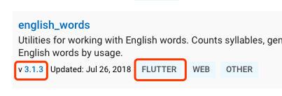
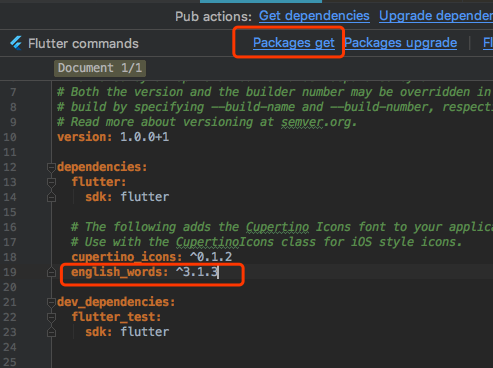
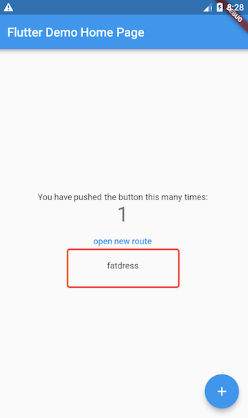

# 2.3 Package management

In software development, there are many public libraries or SDKs that may be used by many projects. Therefore, extract these codes into an independent module, and then directly integrate this module when the project needs to be used, which can greatly improve Development efficiency. Many programming languages ​​or development tools support this "module sharing" mechanism. For example, this independent module in the Java language will be labeled as a jar package, the aar package in Android, and the npm package in web development. For the convenience of presentation, we collectively refer to this sharable independent module as a "package".

An APP often depends on many packages in actual development, and these packages usually have cross-dependencies, version dependencies, etc. It will be very troublesome if the developer manually manages the dependent packages in the application. Therefore, various development ecology or programming language officials usually provide some package management tools. For example, Android provides Gradle to manage dependencies, iOS uses Cocoapods or Carthage to manage dependencies, and Node uses npm. And in Flutter development, there is also its own package management tool. In this section, we mainly introduce how flutter uses configuration files `pubspec.yaml`(located in the project root directory) to manage third-party dependency packages.

YAML is a file format that is intuitive, highly readable and easy to be read by humans. Compared with xml or Json, it has a simple syntax and is very easy to parse, so YAML is often used in configuration files, and Flutter also uses yaml files as its configuration file. The default configuration file of the Flutter project is `pubspec.yaml`, let's look at a simple example:

``` dart 
name: flutter_in_action
description: First Flutter application.

version: 1.0.0+1

dependencies:
 flutter:
   sdk: flutter
 cupertino_icons: ^0.1.2

dev_dependencies:
 flutter_test:
   sdk: flutter

flutter:
 uses-material-design: true

```

Below, we explain the meaning of each field one by one:

-   `name`: Application or package name.
-   `description`: Description and introduction of the application or package.
-   `version`: The version number of the application or package.
-   `dependencies`: Other packages or plug-ins that the application or package depends on.
-   `dev_dependencies`: The toolkit that the development environment depends on (not the package that the flutter application itself depends on).
-   `flutter`: Flutter related configuration options.

If our Flutter application itself relies on a certain package, we need to add the dependent package `dependencies`under. Next, we use an example to demonstrate how to add, download and use a third-party package.

## Pub warehouse

Pub ( [https://pub.dev/](https://pub.dev/) ) is Google’s official Dart Packages repository, similar to the npm repository in node and jcenter in android. We can find the packages and plugins we need on Pub, and we can also publish our packages and plugins to Pub. We will introduce how to publish our packages and plugins to Pub in later chapters.

## Example

Next, we implement a widget that displays a random string. There is an open source software package called "english_words", which contains thousands of commonly used English words and some useful functions. We first find the english_words package on pub (as shown in Figure 2-5) to determine its latest version number and whether it supports Flutter.



We see that the latest version of the "english_words" package is 3.1.3 and supports flutter. Next:

1.  Add "english_words" (version 3.1.3) to the dependency list as follows:
   
``` dart 
   dependencies:
     flutter:
       sdk: flutter
   
     cupertino_icons: ^0.1.0
     # 新添加的依赖
     english_words: ^3.1.3
   
```
   
2.  Download the package. When viewing pubspec.yaml in the editor view of Android Studio (Figure 2-6), click **Packages get in the** upper right corner .
   
   
   
   This will install the dependent packages to your project. We can see the following in the console:
   
``` dart 
   flutter packages get
   Running "flutter packages get" in flutter_in_action...
   Process finished with exit code 0
   
```
   
   We can also locate the current project directory in the console, and then manually run the `flutter packages get`command to download the dependency package. Also, note `dependencies`and `dev_dependencies`distinction, the former dependencies as a part of the source code to compile participation of APP to generate the final installation package. The latter's dependency package is only used as some toolkits in the development stage, mainly used to help us improve the efficiency of development and testing, such as the automated test package of flutter.
   
3.  Introduce the `english_words`package.
   
``` dart 
   import 'package:english_words/english_words.dart';
   
```
   
   When typing, Android Studio will automatically provide suggested options for library import. After importing, the line of code will be grayed out, indicating that the imported library has not been used.
   
4.  Use `english_words`packages to generate random strings.
   
``` dart 
   class RandomWordsWidget extends StatelessWidget {
     @override
     Widget build(BuildContext context) {
      // 生成随机字符串
       final wordPair = new WordPair.random();
       return Padding(
         padding: const EdgeInsets.all(8.0),
         child: new Text(wordPair.toString()),
       );
     }
   }
   
```
   
   We will `RandomWordsWidget`add to `_MyHomePageState.build`the `Column`child widget in.
   
``` dart 
   Column(
     mainAxisAlignment: MainAxisAlignment.center,
     children: <Widget>[
       ... //省略无关代码
       RandomWordsWidget(),
     ],
   )
   
```
   
5.  If the application is running, please use the hot reload button (⚡️ icon) to update the running application. Each time you click hot reload or save a project, a different word pair is randomly selected in the running application. This is because the word pair in the `build`internal method generated. Each time the hot update, the `build`method will be executed, and the running effect is shown in Figure 2-7.
   
   
   

## Other ways of dependence

The dependency method described above is dependent on the Pub repository. But we can also rely on local packages and git repositories.

-   Depend on local package
   
   If we are developing a package locally and the package name is pkg1, we can rely on it in the following ways:
   
``` dart 
   dependencies:
       pkg1:
           path: ../../code/pkg1
   
```
   
   The path can be relative or absolute.
   
-   Rely on Git: You can also rely on packages stored in Git repositories. If the package is located in the root directory of the repository, use the following syntax
   
``` dart 
   dependencies:
     pkg1:
       git:
         url: git://github.com/xxx/pkg1.git
   
```
   
   The above assumes that the package is located in the root directory of the Git repository. If this is not the case, you can use the path parameter to specify the relative position, for example:
   
``` dart 
   dependencies:
     package1:
       git:
         url: git://github.com/flutter/packages.git
         path: packages/package1
   
```
   

The above-mentioned dependency methods are commonly used in Flutter development, but there are some other dependency methods. Readers can check the complete content by themselves: [https://www.dartlang.org/tools/pub/dependencies](https://www.dartlang.org/tools/pub/dependencies) .

## to sum up

This section introduces the overall process of package management, citation, and download in Flutter. We will introduce how to develop and publish our own packages in later chapters.