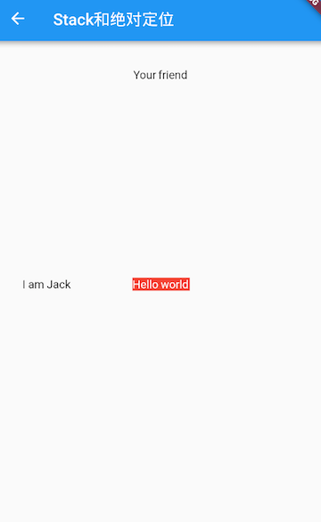

# 4.5 Stack, Positioned

The stacked layout is similar to the absolute positioning in the Web and the Frame layout in Android. The child component can determine its own position according to the position from the four corners of the parent container. Absolute positioning allows sub-components to be stacked (in the order declared in the code). Flutter used `Stack`and `Positioned`these two components to achieve with absolute positioning. `Stack`Allow sub-components to be stacked, and `Positioned`used `Stack`to determine the position of sub-components based on the four corners.

### Stack

``` dart 
Stack({
 this.alignment = AlignmentDirectional.topStart,
 this.textDirection,
 this.fit = StackFit.loose,
 this.overflow = Overflow.clip,
 List<Widget> children = const <Widget>[],
})

```

-   `alignment`: This parameter determines how to align `Positioned`subcomponents that are not positioned (not used ) or partially positioned. The so-called positioning portion, where **especially not positioned on one axis:**`left` , `right`as the horizontal axis `top`, `bottom`vertical axis, comprising a positioning property as long as even if there is a shaft positioned on the shaft.
-   `textDirection`: And `Row`, `Wrap`the `textDirection`functions of the same, are used to determine the `alignment`alignment of the reference frame, namely: `textDirection`the value `TextDirection.ltr`is `alignment`the `start`representative of the left, `end`on behalf of the right, i.e. `从左往右`in the order; `textDirection`value `TextDirection.rtl`, then the alignment of the `start`representative of the right, `end`representing a left, i.e., `从右往左`in the order .
-   `fit`: This parameter is used to determine how to adapt the size of the subcomponents that are **not positioned**`Stack` . `StackFit.loose`Indicates the size of the sub-component used, and the size to which `StackFit.expand`it is expanded `Stack`.
-   `overflow`: This attribute determines how to display `Stack`the sub-components that exceed the display space; `Overflow.clip`when the value is the value , the excess part will be clipped (hidden), `Overflow.visible`when the value is the value will not.

### Positioned

``` dart 
const Positioned({
 Key key,
 this.left, 
 this.top,
 this.right,
 this.bottom,
 this.width,
 this.height,
 @required Widget child,
})

```

`left`, `top`, `right`, `bottom`Representing from `Stack`the left, top, right, bottom from the four sides. `width`And is `height`used to specify the width and height of the element to be positioned. Note that, `Positioned`the `width`, `height`and meaning are slightly different elsewhere herein for engaging `left`, `top`, `right`, `bottom`to locate the assembly, for example, in a horizontal direction, you can specify `left`, `right`, `width`two of the three properties, as specified `left`After the sum `width`, it `right`will automatically calculate ( `left`+ `width`). If three attributes are specified at the same time, an error will be reported. The same is true in the vertical direction.

### Example

In the following example, we `Text`demonstrate the characteristics of `Stack`and `Positioned`by positioning several components :

``` dart 
//通过ConstrainedBox来确保Stack占满屏幕
ConstrainedBox(
 constraints: BoxConstraints.expand(),
 child: Stack(
   alignment:Alignment.center , //指定未定位或部分定位widget的对齐方式
   children: <Widget>[
     Container(child: Text("Hello world",style: TextStyle(color: Colors.white)),
       color: Colors.red,
     ),
     Positioned(
       left: 18.0,
       child: Text("I am Jack"),
     ),
     Positioned(
       top: 18.0,
       child: Text("Your friend"),
     )        
   ],
 ),
);

```

The running effect is shown in Figure 4-9:



Since the first child text component `Text("Hello world")`does not specify a positioning and has a `alignment`value `Alignment.center`, it will be displayed in the center. The second sub-text component `Text("I am Jack")`only specifies the horizontal positioning ( `left`), so it belongs to partial positioning, that is, there is no positioning in the vertical direction, so its vertical alignment will be aligned according to the `alignment`specified alignment, that is, the vertical direction is centered. For the third sub-text component `Text("Your friend")`, the `Text`principle is the same as the second one , except that there is no positioning in the horizontal direction, the horizontal direction is centered.

We `Stack`assign an `fit`attribute to the above example , and then adjust the order of the three sub-text components:

``` dart 
Stack(
 alignment:Alignment.center ,
 fit: StackFit.expand, //未定位widget占满Stack整个空间
 children: <Widget>[
   Positioned(
     left: 18.0,
     child: Text("I am Jack"),
   ),
   Container(child: Text("Hello world",style: TextStyle(color: Colors.white)),
     color: Colors.red,
   ),
   Positioned(
     top: 18.0,
     child: Text("Your friend"),
   )
 ],
),

```

The display effect is shown in Figure 4-10:


As you can see, since the second sub-text component is not positioned, the `fit`properties will work on it and will be full `Stack`. Since the `Stack`child elements are stacked, the first child text component is covered by the second, and the third is on the top layer, so it can be displayed normally.