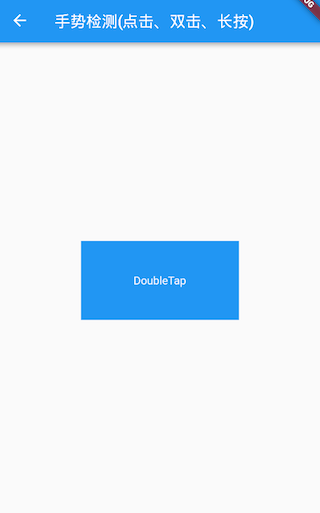

# 8.2 Gesture recognition

This section describes some Flutter first gesture for processing `GestureDetector`and `GestureRecognizer`then carefully discuss gesture competition and conflict.

## 8.2.1 GestureDetector

`GestureDetector`It is a functional component for gesture recognition, through which we can recognize various gestures. `GestureDetector`In fact, it is the semantic encapsulation of pointer events. Next, we will introduce various gesture recognition in detail.

### Tap, double tap, long press

We `GestureDetector`of `Container`the gesture recognition, an appropriate event, the `Container`display on the event name, in order to increase the hit area, the `Container`set of 200 × 100, the code as follows:

``` dart 

class GestureDetectorTestRoute extends StatefulWidget {
 @override
 _GestureDetectorTestRouteState createState() =>
     new _GestureDetectorTestRouteState();
}

class _GestureDetectorTestRouteState extends State<GestureDetectorTestRoute> {
 String _operation = "No Gesture detected!"; //保存事件名
 @override
 Widget build(BuildContext context) {
   return Center(
     child: GestureDetector(
       child: Container(
         alignment: Alignment.center,
         color: Colors.blue,
         width: 200.0, 
         height: 100.0,
         child: Text(_operation,
           style: TextStyle(color: Colors.white),
         ),
       ),
       onTap: () => updateText("Tap"),//点击
       onDoubleTap: () => updateText("DoubleTap"), //双击
       onLongPress: () => updateText("LongPress"), //长按
     ),
   );
 }

 void updateText(String text) {
   //更新显示的事件名
   setState(() {
     _operation = text;
   });
 }
}

```

The running effect is shown in Figure 8-2:



> **Note** : When monitoring `onTap`and `onDoubleTap`events at the same time, when the user triggers a tap event, there will be a delay of about 200 milliseconds. This is because after the user clicks it is likely to click again to trigger the double-click event, so it `GestureDetector`will wait for a while to determine Whether it is a double-click event. If the user only monitors `onTap`(not monitors `onDoubleTap`) the event, there is no delay.

### Drag, slide

A complete gesture process refers to the entire process from pressing the user's finger to lifting, during which the user may or may not move after pressing the finger. `GestureDetector`There is no distinction between drag and sliding events, they are essentially the same. `GestureDetector`The origin (upper left corner) of the component to be monitored will be used as the origin of this gesture. When the user presses a finger on the component to be monitored, gesture recognition will start. Let's look at an example of dragging the circular letter A:

``` dart 
class _Drag extends StatefulWidget {
 @override
 _DragState createState() => new _DragState();
}

class _DragState extends State<_Drag> with SingleTickerProviderStateMixin {
 double _top = 0.0; //距顶部的偏移
 double _left = 0.0;//距左边的偏移

 @override
 Widget build(BuildContext context) {
   return Stack(
     children: <Widget>[
       Positioned(
         top: _top,
         left: _left,
         child: GestureDetector(
           child: CircleAvatar(child: Text("A")),
           //手指按下时会触发此回调
           onPanDown: (DragDownDetails e) {
             //打印手指按下的位置(相对于屏幕)
             print("用户手指按下：${e.globalPosition}");
           },
           //手指滑动时会触发此回调
           onPanUpdate: (DragUpdateDetails e) {
             //用户手指滑动时，更新偏移，重新构建
             setState(() {
               _left += e.delta.dx;
               _top += e.delta.dy;
             });
           },
           onPanEnd: (DragEndDetails e){
             //打印滑动结束时在x、y轴上的速度
             print(e.velocity);
           },
         ),
       )
     ],
   );
 }
}

```

After running, you can drag in any direction, and the running effect is shown in Figure 8-3:


Log:

``` dart 
I/flutter ( 8513): 用户手指按下：Offset(26.3, 101.8)
I/flutter ( 8513): Velocity(235.5, 125.8)

```

Code explanation:

-   `DragDownDetails.globalPosition`: When the user presses, this attribute is the offset of the position where the user presses relative to the origin (upper left corner) of the **screen** (not the parent component).
-   `DragUpdateDetails.delta`: When the user slides on the screen, multiple Update events will be triggered, `delta`which refers to the sliding offset of one Update event.
-   `DragEndDetails.velocity`: This attribute represents the sliding speed when the user lifts the finger (including the x and y axes). The example does not deal with the speed when the finger is lifted. The common effect is to make a deceleration based on the speed when the user lifts the finger Animation.

### Single direction drag

In this example, it can be dragged in any direction, but in many scenes, we only need to drag in one direction, such as a vertical list, which `GestureDetector`can only recognize gesture events in a specific direction. We will use the above example Change it to only drag in the vertical direction:

``` dart 
class _DragVertical extends StatefulWidget {
 @override
 _DragVerticalState createState() => new _DragVerticalState();
}

class _DragVerticalState extends State<_DragVertical> {
 double _top = 0.0;

 @override
 Widget build(BuildContext context) {
   return Stack(
     children: <Widget>[
       Positioned(
         top: _top,
         child: GestureDetector(
           child: CircleAvatar(child: Text("A")),
           //垂直方向拖动事件
           onVerticalDragUpdate: (DragUpdateDetails details) {
             setState(() {
               _top += details.delta.dy;
             });
           }
         ),
       )
     ],
   );
 }
}

```

In this way, you can only drag in the vertical direction. The same is true if you only want to slide in the horizontal direction.

### Zoom

`GestureDetector`You can monitor zoom events. The following example demonstrates a simple image zoom effect:

``` dart 
class _ScaleTestRouteState extends State<_ScaleTestRoute> {
 double _width = 200.0; //通过修改图片宽度来达到缩放效果

 @override
 Widget build(BuildContext context) {
  return Center(
    child: GestureDetector(
       //指定宽度，高度自适应
       child: Image.asset("./images/sea.png", width: _width),
       onScaleUpdate: (ScaleUpdateDetails details) {
         setState(() {
           //缩放倍数在0.8到10倍之间
           _width=200*details.scale.clamp(.8, 10.0);
         });
       },
     ),
  );
 }
}

```

The running effect is shown in Figure 8-4:


Now you can zoom in or zoom out on the picture by opening and contracting two fingers. This example is relatively simple. In practice, we usually need some other functions, such as double-clicking to zoom in or zooming out a certain multiple, and performing a slow-down zoom-in animation when two fingers are spread out of the screen. Readers can learn about the "Animation" chapter later. Try to implement it yourself after the content.

## 8.2.2 GestureRecognizer

`GestureDetector`Internally, one or more are `GestureRecognizer`used to recognize various gestures, and `GestureRecognizer`the function is `Listener`to convert the original pointer events into semantic gestures, `GestureDetector`which can directly receive a sub-widget. `GestureRecognizer`It is an abstract class. A gesture recognizer corresponds to a `GestureRecognizer`subclass. Flutter implements a rich gesture recognizer, which we can use directly.

#### Example

Suppose we want to `RichText`add click event handlers to different parts of a rich text ( ), but it is `TextSpan`not a widget. At this time, we can't use it `GestureDetector`, but `TextSpan`there is an `recognizer`attribute that can receive one `GestureRecognizer`.

Suppose we need to change the color of the text when clicked:

``` dart 
import 'package:flutter/gestures.dart';

class _GestureRecognizerTestRouteState
   extends State<_GestureRecognizerTestRoute> {
 TapGestureRecognizer _tapGestureRecognizer = new TapGestureRecognizer();
 bool _toggle = false; //变色开关

 @override
 void dispose() {
    //用到GestureRecognizer的话一定要调用其dispose方法释放资源
   _tapGestureRecognizer.dispose();
   super.dispose();
 }

 @override
 Widget build(BuildContext context) {
   return Center(
     child: Text.rich(
         TextSpan(
             children: [
               TextSpan(text: "你好世界"),
               TextSpan(
                 text: "点我变色",
                 style: TextStyle(
                     fontSize: 30.0,
                     color: _toggle ? Colors.blue : Colors.red
                 ),
                 recognizer: _tapGestureRecognizer
                   ..onTap = () {
                     setState(() {
                       _toggle = !_toggle;
                     });
                   },
               ),
               TextSpan(text: "你好世界"),
             ]
         )
     ),
   );
 }
}

```

running result:


> Note: After use `GestureRecognizer`, you must call its `dispose()`method to release resources (mainly cancel the internal timer).

## 8.2.3 Gesture competition and conflict

### competition

If in the above example we listen to both horizontal and vertical drag events, which direction will take effect when we drag diagonally? In fact, it depends on the displacement components on the two axes during the first movement, which axis is larger, and which axis wins the competition in this sliding event. In fact, gesture recognition in Flutter introduces the concept of Arena, which is literally translated as "Arena". Every gesture recognizer ( `GestureRecognizer`) is a "competitor" ( `GestureArenaMember`). When a sliding event occurs, they must In the "Arena" to compete for the right to deal with this event, and in the end only one "competitor" will win. For example, suppose there is one `ListView`, and its first child component is also `ListView`, if you slide this child now `ListView`, `ListView`will the parent move? The answer is no, only the child `ListView`will move at this time, because at this time the child `ListView`will win and get the right to handle the sliding event.

### **Example**

Let’s take the drag gesture as an example. It recognizes both horizontal and vertical drag gestures. When the user presses the finger, a competition (horizontal and vertical) is triggered. Once a certain direction "wins", it will continue until the current drag At the end of the gesture, it will move in this direction. code show as below:

``` dart 
import 'package:flutter/material.dart';

class BothDirectionTestRoute extends StatefulWidget {
 @override
 BothDirectionTestRouteState createState() =>
     new BothDirectionTestRouteState();
}

class BothDirectionTestRouteState extends State<BothDirectionTestRoute> {
 double _top = 0.0;
 double _left = 0.0;

 @override
 Widget build(BuildContext context) {
   return Stack(
     children: <Widget>[
       Positioned(
         top: _top,
         left: _left,
         child: GestureDetector(
           child: CircleAvatar(child: Text("A")),
           //垂直方向拖动事件
           onVerticalDragUpdate: (DragUpdateDetails details) {
             setState(() {
               _top += details.delta.dy;
             });
           },
           onHorizontalDragUpdate: (DragUpdateDetails details) {
             setState(() {
               _left += details.delta.dx;
             });
           },
         ),
       )
     ],
   );
 }
}

```

After this example runs, each drag will only move in one direction (horizontal or vertical), and the competition occurs when the finger is pressed for the first time (move). The specific "winning" condition in this example is: the first move The one with the larger displacement in the horizontal and vertical directions wins.

### Gesture conflict

Since there is only one winner in the gesture competition, conflicts may occur when there are multiple gesture recognizers. Suppose there is a widget, which can be dragged left and right. Now we also want to detect the events of finger pressing and lifting on it. The code is as follows:

``` dart 
class GestureConflictTestRouteState extends State<GestureConflictTestRoute> {
 double _left = 0.0;
 @override
 Widget build(BuildContext context) {
   return Stack(
     children: <Widget>[
       Positioned(
         left: _left,
         child: GestureDetector(
             child: CircleAvatar(child: Text("A")), //要拖动和点击的widget
             onHorizontalDragUpdate: (DragUpdateDetails details) {
               setState(() {
                 _left += details.delta.dx;
               });
             },
             onHorizontalDragEnd: (details){
               print("onHorizontalDragEnd");
             },
             onTapDown: (details){
               print("down");
             },
             onTapUp: (details){
               print("up");
             },
         ),
       )
     ],
   );
 }
}

```

Now we hold down the circle "A" and drag and then lift the finger, the console log is as follows:

``` dart 
I/flutter (17539): down
I/flutter (17539): onHorizontalDragEnd

```

We found that "up" is not printed. This is because when dragging, when there is no movement when the finger is first pressed down, the drag gesture does not have complete semantics. At this time, the TapDown gesture wins (win) and prints "down" "and when you drag, drag gesture will win, when the finger is lifted, `onHorizontalDragEnd`and `onTapUp`clashed, but because it is in drag semantics, so `onHorizontalDragEnd`to win, so it will print" onHorizontalDragEnd ". If our code logic is strongly dependent on finger pressing and lifting, for example, in a carousel component, we hope that when the finger is pressed, the carousel will be paused, and the carousel will be resumed when the finger is lifted. sowing view of the assembly in itself may have dealt with the drag gesture (slide support manual switching), may even support the zoom gesture, then if we then externally `onTapDown`, `onTapUp`to listen to the words is not enough. What should we do at this time? It's actually very simple, just listen to the original pointer event through the Listener:

``` dart 
Positioned(
 top:80.0,
 left: _leftB,
 child: Listener(
   onPointerDown: (details) {
     print("down");
   },
   onPointerUp: (details) {
     //会触发
     print("up");
   },
   child: GestureDetector(
     child: CircleAvatar(child: Text("B")),
     onHorizontalDragUpdate: (DragUpdateDetails details) {
       setState(() {
         _leftB += details.delta.dx;
       });
     },
     onHorizontalDragEnd: (details) {
       print("onHorizontalDragEnd");
     },
   ),
 ),
)

```

Gesture conflict is only at the gesture level, and gestures are the semantic recognition of the original pointer, so when encountering complex conflict scenarios, the conflict can be resolved by `Listener`directly identifying the original pointer event.