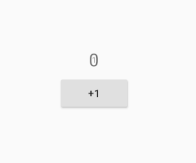
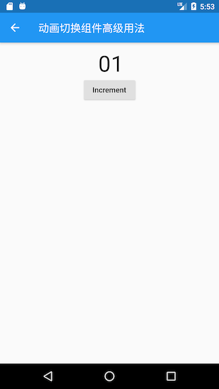

# 9.6 General "Animated Switcher" component (AnimatedSwitcher)

In actual development, we often encounter scenarios where UI elements are switched, such as Tab switching and routing switching. In order to enhance the user experience, an animation is usually specified when switching to make the switching process appear smooth. The Flutter SDK component library already provides some commonly used switching components, such as `PageView`, `TabView`etc., but these components cannot cover all demand scenarios. For this reason, the Flutter SDK provides a `AnimatedSwitcher`component that defines a general UI switch abstract.

## 9.6.1 AnimatedSwitcher

`AnimatedSwitcher`You can add show and hide animations to its new and old child elements at the same time. In other words, when `AnimatedSwitcher`the child element changes, the old element and the new element will be changed. Let's take a look at `AnimatedSwitcher`the definition of:

``` dart 
const AnimatedSwitcher({
 Key key,
 this.child,
 @required this.duration, // 新child显示动画时长
 this.reverseDuration,// 旧child隐藏的动画时长
 this.switchInCurve = Curves.linear, // 新child显示的动画曲线
 this.switchOutCurve = Curves.linear,// 旧child隐藏的动画曲线
 this.transitionBuilder = AnimatedSwitcher.defaultTransitionBuilder, // 动画构建器
 this.layoutBuilder = AnimatedSwitcher.defaultLayoutBuilder, //布局构建器
})

```

When `AnimatedSwitcher`the child changes (the type or key is different), the old child will execute the hidden animation, and the new child will execute the display animation. Which animation effect is executed is `transitionBuilder`determined by the parameter, which accepts a `AnimatedSwitcherTransitionBuilder`type of builder, defined as follows:

``` dart 
typedef AnimatedSwitcherTransitionBuilder =
 Widget Function(Widget child, Animation<double> animation);

```

The `builder`at `AnimatedSwitcher`will, respectively, for the old and new bindings child animation when the child switches:

1.  For the old child, the bound animation will be executed in reverse (reverse)
2.  For the new child, the bound animation will be forwarded

In this way, the animation binding of the new and old children is realized. `AnimatedSwitcher`The default value is `AnimatedSwitcher.defaultTransitionBuilder`:

``` dart 
Widget defaultTransitionBuilder(Widget child, Animation<double> animation) {
 return FadeTransition(
   opacity: animation,
   child: child,
 );
}

```

As you can see, the `FadeTransition`object is returned , which means that by default, the `AnimatedSwitcher`new and old children will be "fade" and "fade in" animation.

### example

Let's take a look at an example: implement a counter, and then in the process of each increment, the old number executes the zoom-in animation hide, and the new number executes the zoom-in animation display. The code is as follows:

``` dart 
import 'package:flutter/material.dart';

class AnimatedSwitcherCounterRoute extends StatefulWidget {
  const AnimatedSwitcherCounterRoute({Key key}) : super(key: key);

  @override
  _AnimatedSwitcherCounterRouteState createState() => _AnimatedSwitcherCounterRouteState();
}

class _AnimatedSwitcherCounterRouteState extends State<AnimatedSwitcherCounterRoute> {
  int _count = 0;

  @override
  Widget build(BuildContext context) {
    return Center(
      child: Column(
        mainAxisAlignment: MainAxisAlignment.center,
        children: <Widget>[
          AnimatedSwitcher(
            duration: const Duration(milliseconds: 500),
            transitionBuilder: (Widget child, Animation<double> animation) {
              //执行缩放动画
              return ScaleTransition(child: child, scale: animation);
            },
            child: Text(
              '$_count',
              //显示指定key，不同的key会被认为是不同的Text，这样才能执行动画
              key: ValueKey<int>(_count),
              style: Theme.of(context).textTheme.headline4,
            ),
          ),
          RaisedButton(
            child: const Text('+1',),
            onPressed: () {
              setState(() {
                _count += 1;
              });
            },
          ),
        ],
      ),
    );
  }
}

```

Run the sample code, when you click the "+1" button, the original number will gradually shrink until it is hidden, while the new number will gradually enlarge. I captured a frame of the animation execution process, as shown in Figure 9-5:



The above picture is a frame of switching animation after clicking the "+1" button for the first time. At this time, "0" is gradually shrinking, and "1" is in the middle of "0" and is gradually zooming in.

> Note: The old and new children of AnimatedSwitcher, if the types are the same, the Key must not be equal.

### AnimatedSwitcher implementation principle

In fact, `AnimatedSwitcher`the implementation principle is relatively simple, and we `AnimatedSwitcher`can also guess the general idea based on the usage. In order to realize the switching animation of the old and new child, only two issues need to be clarified: the timing of the animation execution and how to perform the animation on the old and new child. From `AnimatedSwitcher`the usage method, we can see that when the child changes (the child widget's key and type **are** different, it is considered to have changed), it will be executed again `build`, and then the animation will start to execute. We can achieve this by inheriting StatefulWidget `AnimatedSwitcher`. The specific `didUpdateWidget`method is to determine whether the old and new child has changed in the callback. If there is a change, perform a reverse exit animation for the old child, and perform a forward entry for the new child. Animation is fine. The following is `AnimatedSwitcher`part of the core pseudo code:

``` dart 
Widget _widget; //
void didUpdateWidget(AnimatedSwitcher oldWidget) {
 super.didUpdateWidget(oldWidget);
 // 检查新旧child是否发生变化(key和类型同时相等则返回true，认为没变化)
 if (Widget.canUpdate(widget.child, oldWidget.child)) {
   // child没变化，...
 } else {
   //child发生了变化，构建一个Stack来分别给新旧child执行动画
  _widget= Stack(
     alignment: Alignment.center,
     children:[
       //旧child应用FadeTransition
       FadeTransition(
        opacity: _controllerOldAnimation,
        child : oldWidget.child,
       ),
       //新child应用FadeTransition
       FadeTransition(
        opacity: _controllerNewAnimation,
        child : widget.child,
       ),
     ]
   );
   // 给旧child执行反向退场动画
   _controllerOldAnimation.reverse();
   //给新child执行正向入场动画
   _controllerNewAnimation.forward();
 }
}

//build方法
Widget build(BuildContext context){
 return _widget;
}

```

The pseudo-code above shows the `AnimatedSwitcher`core logic `AnimatedSwitcher`of the implementation . Of course, the real implementation is more complicated than this. It can customize the transition animation of entering and exiting the scene and the layout when executing the animation. Here, we delete the complicated and keep it simple, and let the readers clearly see the main realization ideas through the pseudo-code form `AnimatedSwitcher`.

Further, Flutter SDK also provides a `AnimatedCrossFade`component that can be switched two sub-elements, a handover procedure performed fade fade animation, and `AnimatedSwitcher`the difference is `AnimatedCrossFade`that for the two sub-elements, and `AnimatedSwitcher`is a child between the old and new values of element Switch. `AnimatedCrossFade`The implementation principle is relatively simple, and there are `AnimatedSwitcher`similarities, so I won’t go into details here. Readers who are interested can view the source code.

## 9.6.2 Advanced usage of AnimatedSwitcher

Suppose now we want to implement an animation similar to routing translation switching: in the old page screen, pan to the left to exit, and the new page re-enters to the right of the screen. If we want to use AnimatedSwitcher, we will soon find a problem: it can't be done! We might write the following code:

``` dart 
AnimatedSwitcher(
 duration: Duration(milliseconds: 200),
 transitionBuilder: (Widget child, Animation<double> animation) {
   var tween=Tween<Offset>(begin: Offset(1, 0), end: Offset(0, 0))
    return SlideTransition(
      child: child,
      position: tween.animate(animation),
   );
 },
 ...//省略
)

```

What's wrong with the above code? We mentioned earlier that when `AnimatedSwitcher`the child is switched, the forward animation is performed on the new child, and the reverse animation is performed on the old child, so the real effect is: the new child does enter from the right side of the screen. , But the old child will exit from the **right side of the** screen instead of the left side. In fact, it is easy to understand, because without special treatment, the forward and reverse directions of the same animation are exactly opposite (symmetrical).

So the question is, can't it be used `AnimatedSwitcher`? Of course the answer is no! Think about this problem carefully. The reason is that the same `Animation`forward and reverse are symmetrical. So if we can break this symmetry, then we can achieve this function. Let's encapsulate one `MySlideTransition`. The `SlideTransition`only difference is that the reverse execution of the animation is customized (slide out from the left to hide), the code is as follows:

``` dart 
class MySlideTransition extends AnimatedWidget {
 MySlideTransition({
   Key key,
   @required Animation<Offset> position,
   this.transformHitTests = true,
   this.child,
 })
     : assert(position != null),
       super(key: key, listenable: position) ;

 Animation<Offset> get position => listenable;
 final bool transformHitTests;
 final Widget child;

 @override
 Widget build(BuildContext context) {
   Offset offset=position.value;
   //动画反向执行时，调整x偏移，实现“从左边滑出隐藏”
   if (position.status == AnimationStatus.reverse) {
        offset = Offset(-offset.dx, offset.dy);
   }
   return FractionalTranslation(
     translation: offset,
     transformHitTests: transformHitTests,
     child: child,
   );
 }
}

```

When calling, just `SlideTransition`replace it with `MySlideTransition`:

``` dart 
AnimatedSwitcher(
 duration: Duration(milliseconds: 200),
 transitionBuilder: (Widget child, Animation<double> animation) {
   var tween=Tween<Offset>(begin: Offset(1, 0), end: Offset(0, 0))
    return MySlideTransition(
             child: child,
             position: tween.animate(animation),
             );
 },
 ...//省略
)

```

After running, I intercepted a frame during the execution of the animation, as shown in Figure 9-6:



In the picture above, "0" slides out from the left, and "1" slides in from the right. It can be seen that we have implemented an animation similar to the routing switch in this clever way. In fact, the Flutter routing switch is also achieved through `AnimatedSwitcher`this.

### SlideTransitionX

In the above example, we have realized the animation of "left in and right in", what if we want to realize "right in and left out", "top in and bottom out" or "bottom in and top out"? Of course, we can modify the above code separately, but in this way each animation has to define a "Transition" separately, which is very troublesome. This section will encapsulate a universal `SlideTransitionX`to realize this "in and out sliding animation", the code is as follows:

``` dart 
class SlideTransitionX extends AnimatedWidget {
 SlideTransitionX({
   Key key,
   @required Animation<double> position,
   this.transformHitTests = true,
   this.direction = AxisDirection.down,
   this.child,
 })
     : assert(position != null),
       super(key: key, listenable: position) {
   // 偏移在内部处理      
   switch (direction) {
     case AxisDirection.up:
       _tween = Tween(begin: Offset(0, 1), end: Offset(0, 0));
       break;
     case AxisDirection.right:
       _tween = Tween(begin: Offset(-1, 0), end: Offset(0, 0));
       break;
     case AxisDirection.down:
       _tween = Tween(begin: Offset(0, -1), end: Offset(0, 0));
       break;
     case AxisDirection.left:
       _tween = Tween(begin: Offset(1, 0), end: Offset(0, 0));
       break;
   }
 }


 Animation<double> get position => listenable;

 final bool transformHitTests;

 final Widget child;

 //退场（出）方向
 final AxisDirection direction;

 Tween<Offset> _tween;

 @override
 Widget build(BuildContext context) {
   Offset offset = _tween.evaluate(position);
   if (position.status == AnimationStatus.reverse) {
     switch (direction) {
       case AxisDirection.up:
         offset = Offset(offset.dx, -offset.dy);
         break;
       case AxisDirection.right:
         offset = Offset(-offset.dx, offset.dy);
         break;
       case AxisDirection.down:
         offset = Offset(offset.dx, -offset.dy);
         break;
       case AxisDirection.left:
         offset = Offset(-offset.dx, offset.dy);
         break;
     }
   }
   return FractionalTranslation(
     translation: offset,
     transformHitTests: transformHitTests,
     child: child,
   );
 }
}

```

Now, if we want to implement various "sliding in and out animations", it is very easy. We only need to `direction`pass different direction values. For example, if we want to achieve "top in and bottom out", then:

``` dart 
AnimatedSwitcher(
 duration: Duration(milliseconds: 200),
 transitionBuilder: (Widget child, Animation<double> animation) {
   var tween=Tween<Offset>(begin: Offset(1, 0), end: Offset(0, 0))
    return SlideTransitionX(
             child: child,
                      direction: AxisDirection.down, //上入下出
             position: animation,
             );
 },
 ...//省略其余代码
)

```

After running, I intercepted a frame during the execution of the animation, as shown in Figure 9-7:


In the picture above, "1" slides out from the bottom, and "2" slides in from the top. Readers can try to give `SlideTransitionX`a `direction`different value to view operating results.

## to sum up

In this section, we learned the `AnimatedSwitcher`detailed usage, and also introduced the `AnimatedSwitcher`method to break the symmetry of animation. We can find that `AnimatedSwitcher`it is very useful in scenarios where you need to switch between the new and old UI elements .